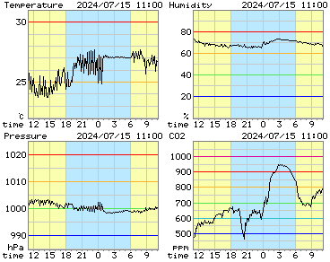

# Room_Environment_Manager

ESP32-based environment manager with Slack

## About

This project can do

* measure temperature, humidity, atmospheric pressure, and CO2 concentration
* show room environment on display
* send room environment on Slack every 1 hour
* send room environment graph (bitmap image) on Slack
* control an air conditioner via Slack

Graphs:

## Hardware

You need

* [ESP32 Dev Module (4MB)](https://akizukidenshi.com/catalog/g/g115673/)
* [SHT31](https://akizukidenshi.com/catalog/g/g112125/)
  * Temperature & Humidity Sensor
  * I2C
* [LPS25HB](https://akizukidenshi.com/catalog/g/g113460/)
  * Atmospheric Pressure Sensor
  * I2C
* [MH-Z19C](https://akizukidenshi.com/catalog/g/g116142/)
  * CO2 Sensor
  * Serial (RX=16, TX=17)
* [SC2004CSLB](https://akizukidenshi.com/catalog/g/g100036/)
  * LCD Character Module (20x4)
* Infrared LED
  * Air Conditioner Controller
* Air Conditioner
  * I used Panasonic's one

## Slack

You need

* Slack bot token
  * channels:history
  * channels:write
  * files:write